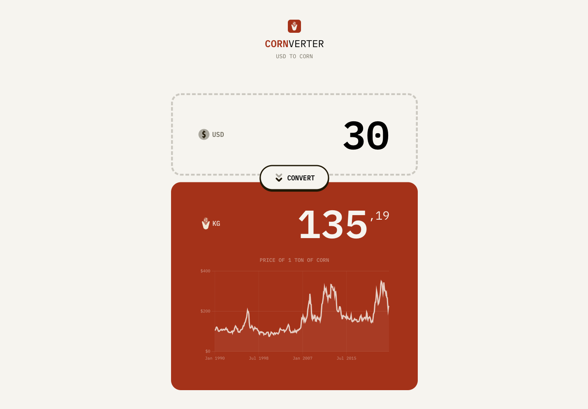

<!-- ABOUT THE PROJECT -->
# Cornverter

A small app that converts dollars into how much corn you can buy

## Description



I worked on this project in november 2023 with the goal of learning the basics of backend development with NodeJS and Express.

It is an exercise which is part of the Becode bootcamp. The goal was to create a currency converter.


## Built With

* Vite
* Express
* ChartJS


<!-- GETTING STARTED -->
# Getting Started

## Prerequisites

You need to have node and npm installed on your machine to run this project locally.  

### npm
  ```sh
  npm install npm@latest -g
  ```

## Installation

### 1. Clone the repo
```sh
git clone https://github.com/louis-va/cornverter
```
### 2. Install NPM packages
```sh
npm install
```

## Execution 
```sh
npm run dev
```
